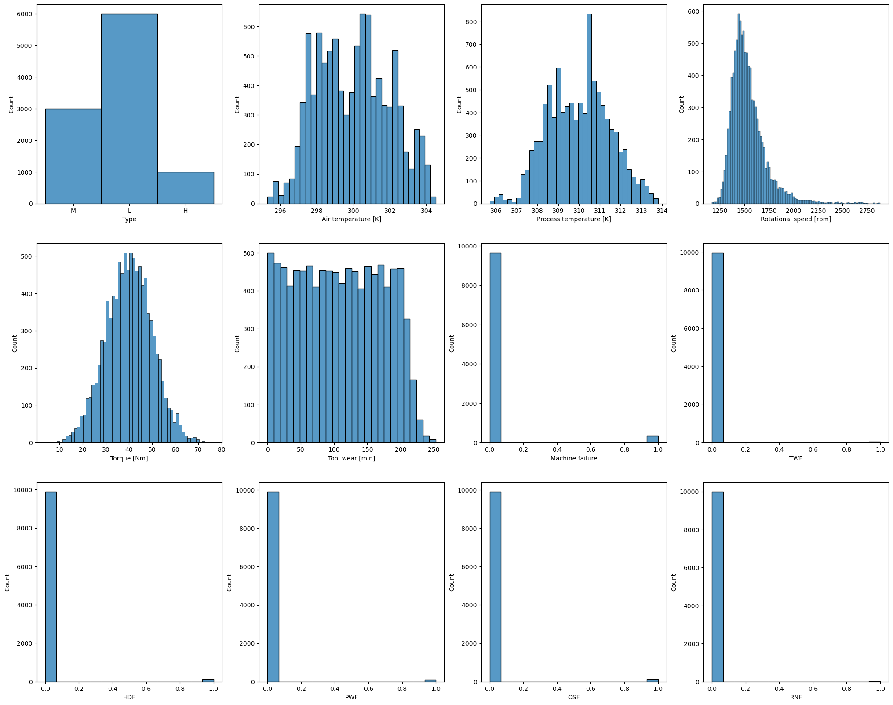
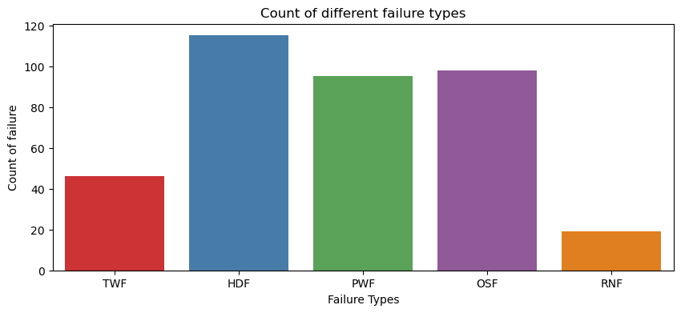
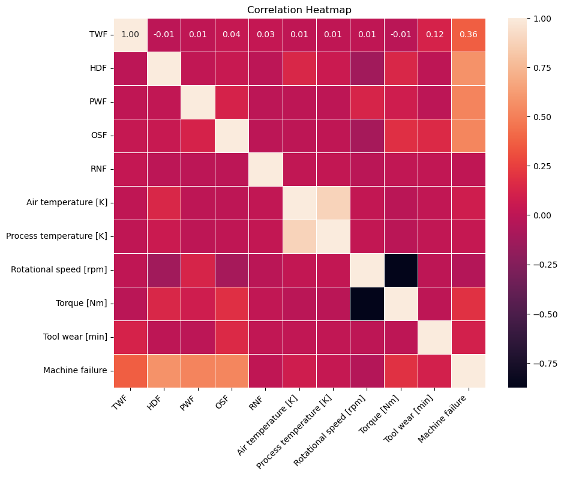
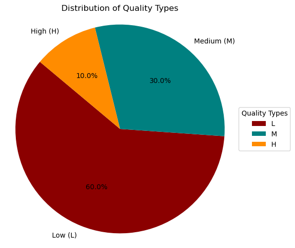

# Predictive Maintenance for Milling Machines

## Project Description
This project focuses on predicting the need for maintenance in milling machines to minimize downtime and optimize operations. By analyzing the "AI4I 2020 Predictive Maintenance Dataset" from the UCI Machine Learning Repository, we build machine learning models that can predict potential machine failures, identify critical factors influencing maintenance needs, and recommend actions to prevent unexpected breakdowns.

---

## Problem Statement
Milling machines are essential in many industries, but unexpected failures can lead to costly delays and operational inefficiencies. Predictive maintenance offers a proactive approach by forecasting failures before they occur, enabling timely interventions and reducing downtime. The goal is to develop a predictive model to classify and predict potential failures (e.g., tool wear, overstrain, heat dissipation issues) in milling machines based on real-world sensor data.

---

## Dataset
The dataset used is the **AI4I 2020 Predictive Maintenance Dataset**, available on the [UCI Machine Learning Repository](https://archive.ics.uci.edu/dataset/601/ai4i+2020+predictive+maintenance+dataset).

**Dataset Features**:
- **UDI**: Unique identifier for each record.
- **Product ID**: Identifier of the product being processed.
- **Type**: Machine type (High, Medium, Low).
- **Air temperature [°C]**: Environmental condition.
- **Process temperature [°C]**: Temperature during machining.
- **Rotational speed [rpm]**: Spindle speed.
- **Torque [Nm]**: Torque applied during machining.
- **Tool wear [min]**: Cumulative tool usage.
- **Target Variables**:
  - **Failure Type** (No Failure, Heat Dissipation, Power Failure, Overstrain, Tool Wear, Random Failures).
  - **Machine Failure** (binary classification).
- **Dataset Size**: 10,000 samples, 8 features, and 6 labels.

---

## EDA

   

---

## Results
The Decision Tree model used provided a strong balance between interpretability and performance, achieving an accuracy of 89% and an F1-Score of 0.85 in predicting machine failures.

**The Key features influencing failures include**:
- **Tool wear time:** had the highest correlation with failure events.
- **Process temperature:** and rotational speed significantly impacted failure likelihood.

---

## How to Run
1. Clone the repository:
   ```bash
   git clone https://github.com/yourusername/predictive-maintenance-milling.git
   ```

2. Install dependencies:
   ```bash
   pip install -r requirements.txt
   ```

3. Run the Jupyter Notebook for EDA and modeling:
   ```bash
   jupyter notebook
   ```

4. (Optional) Launch the web app:
   ```bash
   streamlit run app.py
   ```

---
