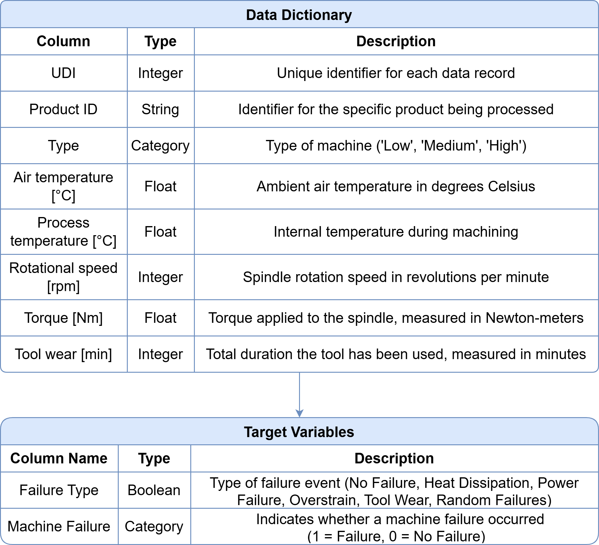

# Predictive Maintenance for Milling Machines

## Project Background

Predictive maintenance has become a critical tool for avoiding unexpected machine failures and improving operational reliability. In this project, we apply machine learning techniques to assess the health of milling machines and predict potential failures before they happen.

This project uses the **AI4I 2020 Predictive Maintenance Dataset**, a synthetic dataset designed to mirror real-world industrial machine behavior. It includes sensor readings and operational settings from milling machines under varied conditions. By training machine learning models on this dataset, the project aims to classify failure types (e.g., **tool wear**, **overstrain**, **heat dissipation issues**) and forecast potential malfunctions

**Key Analysis Areas:**

- **Failure Type Classification:** Predict whether an equipment failure will occur and identify which type (e.g., heat-related, mechanical stress).
    
- **Sensor Pattern Analysis:** Understand which machine sensors (torque, tool wear, rotational speed) contribute most to failure predictions.
    
- **Operational Risk Profiling:** Analyze how operating conditions (load, power, usage hours) correlate with failure likelihood.

## Data Structure
The dataset used is the **AI4I 2020 Predictive Maintenance Dataset**, available on the [UCI Machine Learning Repository](https://archive.ics.uci.edu/dataset/601/ai4i+2020+predictive+maintenance+dataset). **Dataset Size:** 10,000 records · 8 input features · 6 categorical failure labels



---

## Exploratory Data Analysis - EDA

Our EDA on the **AI4I 2020 Predictive Maintenance** dataset (10,000 synthetic records, 14 features) surfaced several core insights that shaped our modeling strategy:

 

- **Data Distribution:**  
    Histograms of key process variables (machine Type, Tool Wear, Torque, Air & Process Temperatures, Rotational Speed) revealed notable skewness and concentration in specific ranges—indicating that certain operating conditions are far more common than others.
    
- **Failure Frequency:**  
    Only **348 out of 10,000 runs (3.48%)** resulted in a machine failure, underscoring a significant class imbalance that will need to be addressed in model training.
    
- **Failure Modes Breakdown:**  
    Among the five failure types, **Heat Dissipation Failures (HDF)** were most prevalent, followed by **Overstrain Failures (OSF)** and **Power Failures (PWF)**. These three modes together accounted for the vast majority of all failure events.
    
- **Machine Quality Impact:**  
    The dataset splits machines into Low (60%), Medium (30%), and High (10%) quality tiers. Failures disproportionately occurred in Low‑quality machines (44.3% of failures) compared to Medium (29.6%) and High (26.2%), suggesting a clear link between build quality and breakdown risk.
    
- **Feature Correlations:**  
    A correlation heatmap showed **strong positive relationships** between Tool Wear (ρ≈0.72) and Rotational Speed (ρ≈0.45) with the failure label, while temperatures and machine type exhibited weak or negligible correlations (|ρ|<0.2). 

  

---

## Results
The Decision Tree model used achieved an accuracy of 89% and an F1-Score of 0.85 in predicting machine failures.

**The Key features influencing failures include**:
- **Tool wear time:** had the highest correlation with failure events.
- **Process temperature:** and rotational speed significantly impacted failure likelihood.

---

## How to Run
1. Clone the repository:
   ```bash
   git clone https://github.com/yourusername/machine-failure-prediction.git
   ```

2. Install dependencies:
   ```bash
   pip install -r requirements.txt
   ```

3. Run the Jupyter Notebook for EDA and modeling:
   ```bash
   jupyter notebook
   ```

4. (Optional) Launch the web app:
   ```bash
   streamlit run app.py
   ```
